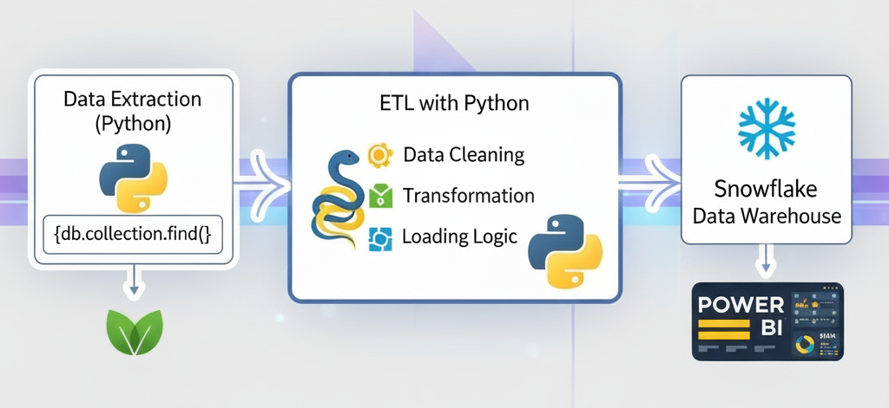
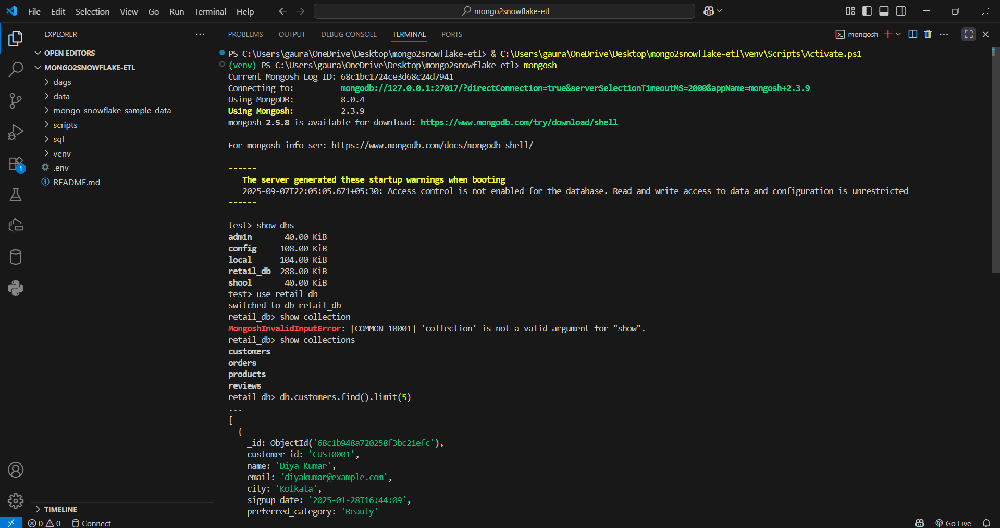

# MongoDB to Snowflake ETL & Power BI Dashboard

  

## Overview
This project demonstrates an end-to-end **ETL pipeline** where data is extracted from **MongoDB**, transformed, and loaded into **Snowflake**. Insights from the data are visualized using **Power BI** dashboards. 

The pipeline is designed to be simple, efficient, and scalable for retail/analytics datasets.

---

## Project Features
- Extracts data from MongoDB collections.
- Transforms nested and unstructured data into structured tables.
- Loads transformed data into Snowflake tables.
- Power BI dashboard for visualizing trends, metrics, and KPIs.
- Includes multiple visualization types like bar charts, line charts, and heatmaps.
- Clean, organized code structure for ETL scripts and dashboard files.

---

## Folder Structure
```
MONGO2SNOWFLAKE-ETL/
│
├── data/                       # Data storage
│ ├── raw/                      # Raw JSONL data from MongoDB
│ │ ├── customers.jsonl
│ │ ├── orders.jsonl
│ │ ├── products.jsonl
│ │ └── reviews.jsonl
│ │
│ ├── staged/                   # Transformed / Staged data for Snowflake
│   ├── dim_customers.csv
│   ├── dim_products.csv
│   ├── fact_order_items.csv
│   ├── fact_orders.csv
│   └── fact_reviews.csv
│
│── customers.jsonl             #These 4 ".jsonl" files are the orginal dataset, on which we perform our task
│── orders.jsonl
│── products.jsonl
│── reviews.jsonl
│
│
├── scripts/                     # Python scripts for ETL (extract, transform, load)
│ ├── extract_mongo.py           # Extract data from MongoDB
│ ├── load_data_to_mongo.py      # Load raw data to MongoDB
│ ├── load_to_snowflake.py       # Load staged data to Snowflake
│ └── transform.py               # Transform raw → staged data
│
│
├── sql/                         # SQL scripts for Snowflake
│ ├── analytics.sql              # Analytical queries
│ └── create_tables.sql          # Snowflake schema creation
│
├──PowerBI_Dashboard/            # Power BI files (.pbix)
│
├── venv/                        # Virtual environment (not uploaded to GitHub)
├── .env                         # Environment variables (credentials, configs)
├── Pic/                         # Images used in README or dashboard
└── README.md                    # Project documentation
```

## Screenshots
### Data Set before Processing
I have a retail_db database that contains four collections: customers, orders, products, and reviews. Each collection has thousands of documents on which we are performing our tasks
 

### Number of Records in each Documents - Mongo Compass
 

### Structure of Data - Mongo Shell
Data view in Mongo Shell, displayed in JSON format.
 

### How to Switch to DB, Collections & Documents through Terminal
 

### Database, Schema, and Table Creation in Snowflake
It shows the creation of a database, schema, and tables in **Snowflake** to store data coming from **MongoDB**.  
The workflow followed:
1. **Extract:** Data is extracted from MongoDB using a Python script and stored in the **raw** layer.  
2. **Transform:** The extracted data is cleaned and transformed using Python scripts.
3. **Load:** The transformed data is then loaded into these **Snowflake tables** (staged layer) for further analysis.

### Data Cleaning & Transformation
In this step, we performed several data cleaning operations to prepare the dataset for analysis, including:
- **Renaming attributes** to make them consistent and meaningful.
- **Removing the `_id` attribute** which was not required for further processing.
- **Restructuring nested data** to simplify the schema and make it easier to query.
 

### Analytics Query Results in Snowflake (Snowsight) with basic Visualization
It shows the result of an analytical query executed in **Snowflake Snowsight**.  
The query retrieves product-level revenue data after performing transformations and loading the cleaned dataset into Snowflake tables.
 
 

### Loading Data in PowerBI through Snowflake


### Data Loading in Power Query (via Power BI)
The transformed data from Snowflake was connected to **Power BI** and loaded into **Power Query**.  
In Power Query, we performed basic data preparation steps such as:
- Verifying column names and data types.
- Applying filters to remove unnecessary rows.
- Ensuring data is ready for building dashboards and visualizations.


### Powerbi Dashboard

### Page 1


### Page 2


---

## Tech Stack
- **MongoDB**: Source database for raw data.
- **Python**: ETL scripts using pandas and pymongo.
- **Snowflake**: Cloud-based data warehouse.
- **Power BI**: Data visualization and reporting.

---

## How to Run
1. Clone the repository:  
   git clone https://github.com/your-username/mongo-to-snowflake-etl-dashboard.git
Install Python dependencies:

pip install -r requirements.txt
Update config.py with your MongoDB and Snowflake credentials.

Run ETL scripts in order:

python scripts/extract_mongo.py
python scripts/transform.py
python scripts/load_to_snowflake.py
Open the Power BI dashboard (PowerBI_Dashboard/project_dashboard.pbix) and connect to Snowflake.

Sample Data
If your dataset is large, provide a small sample in data/sample_data/.

Include instructions for connecting MongoDB collections or Snowflake tables.

Author
Gaurav Kumar

Data Engineering & Analytics Enthusiast

Linkedln: https://www.linkedin.com/in/gaurav-kumar-4124732a4/
